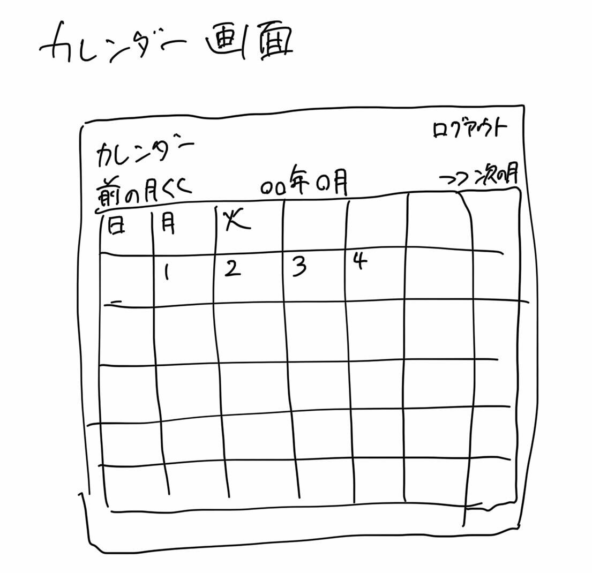
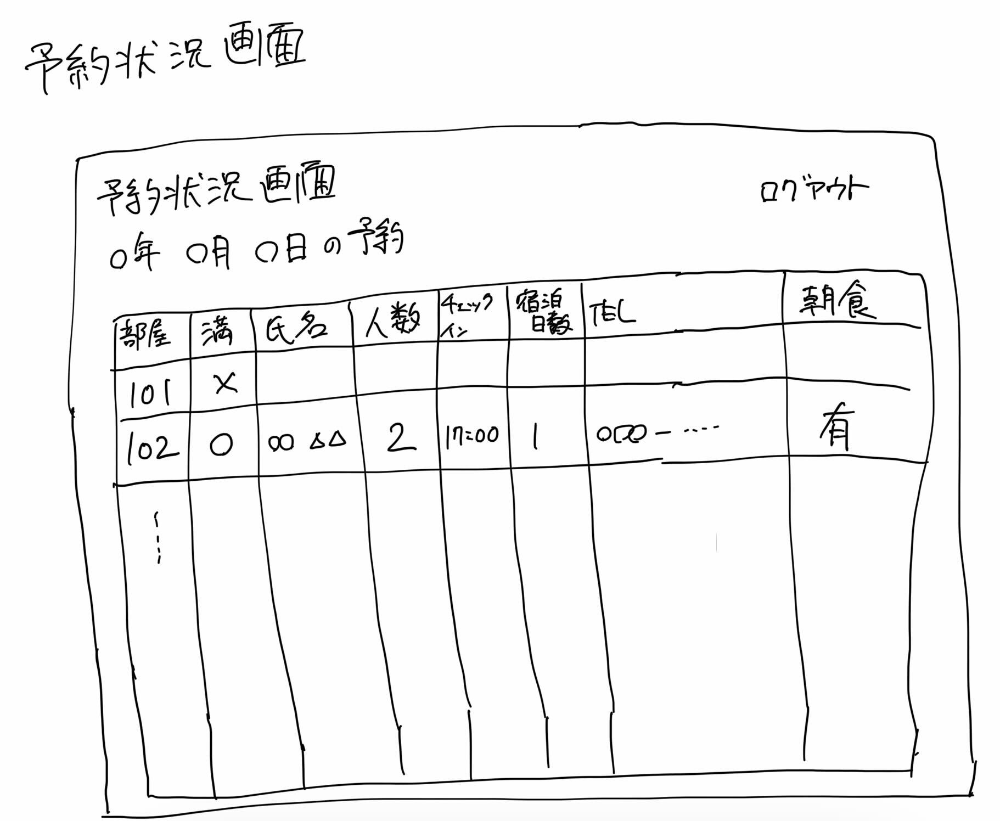

# ユースケース 3： 予約リストを見る

## 概要
フロントが予約リストを見て，全ての予約を確認する

## アクター
- フロント

## 事前条件
- フロントがシステムにログインしていること

## 事後条件
- フロントがカレンダーの日ごとの宿泊部屋の予約状況を確認できる

## トリガ―
- フロントがログインに成功する，または，
- フロントが各画面から，「予約リスト」ボタンを押す

## 基本フロー
1. フロントがログインに成功する，または，画面から「予約リスト」ボタンを押す．
2. システムは，本日の年月日を取得する．
3. システムは，その月の全予約を検索し，カレンダー画面（UI紙芝居参照）を表示する．
4. ユーザはカレンダー上の日付をクリックする．
5. システムはその日付（年月日）の予約状況画面（UI紙芝居参照）を表示する．予約状況画面とは，システムが全宿泊部屋の予約情報を，部屋ごとに表示する．予約情報とは，部屋ごとに空室または満室であるか，満室であればその部屋の宿泊者の氏名，人数，チェックイン時間，宿泊日数，電話番号，朝食の有無のことを指す．

## 代替フロー
### 代替フロー1
- 4a.1  基本フロー4で，ユーザが別の月の予約を見たい場合には，次の月（または前の月）をクリックする．
- 4a.2  システムは当該月を次の月（または前の月）にセットし，3に戻る．

## GUI紙芝居
### 予約カレンダー画面

### 予約状況画面

