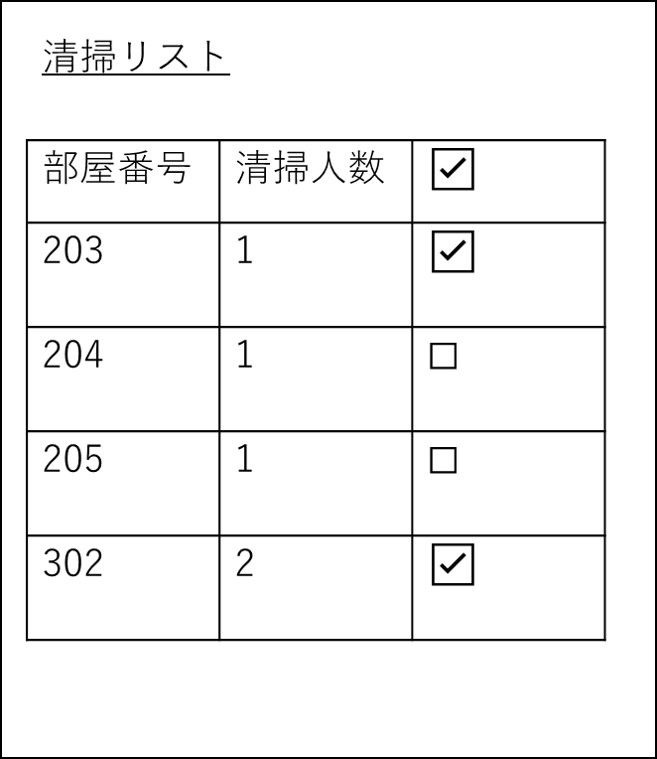
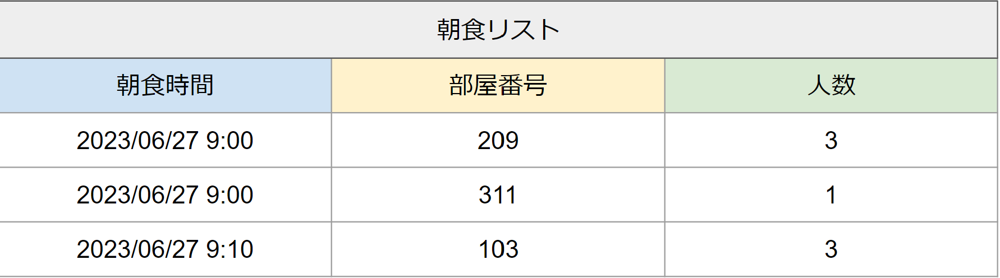

# ユースケース4:掃除リストを見る
## 概要
- 清掃員が掃除リストを見るための機能
## アクター
- 清掃員
##　事前条件
- 清掃員に当たるユーザーIDでログインしている
## 事後条件
- 掃除リストの横のチェックボックスがクリックできる
## トリガー
清掃員が、清掃IDでログインする
## 基本フロー
1. 掃除リストを表示する

## GUI紙芝居

=======
# ユースケース 3： 朝食リストを見る

## 概要
厨房担当が朝食リストを見て，朝食の予約を確認する

## アクター
- 厨房担当

## 事前条件
- 厨房担当がシステムにログインしていること

## 事後条件
- 厨房担当が朝食が必要な部屋の番号、人数、朝食時間を確認する。

## トリガ―
- 厨房担当がログインに成功する

## 基本フロー
1. 厨房担当がログインに成功する．
2. システムは，担当選択画面を表示する。
3. 厨房担当は、「厨房担当画面」ボタンを押す。
4. システムは、データベースから朝食の時間が登録されたお客さん情報を参照して、朝食が必要な部屋の番号・人数・朝食時間をリストにまとめて表示する。

## GUI紙芝居
### 朝食リスト画面

